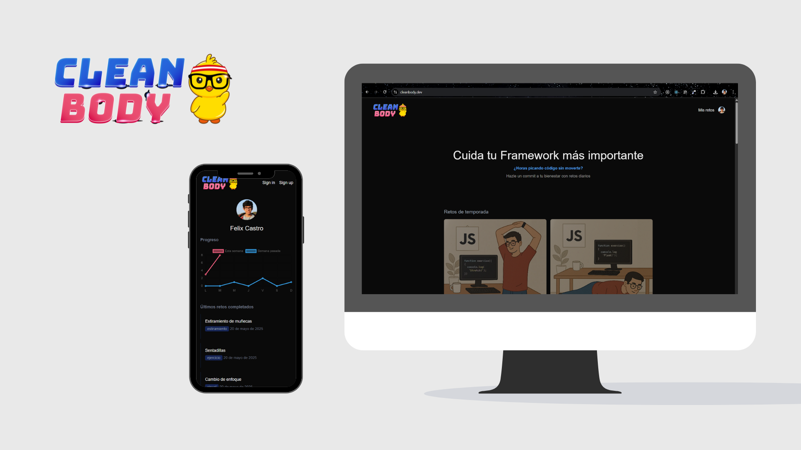
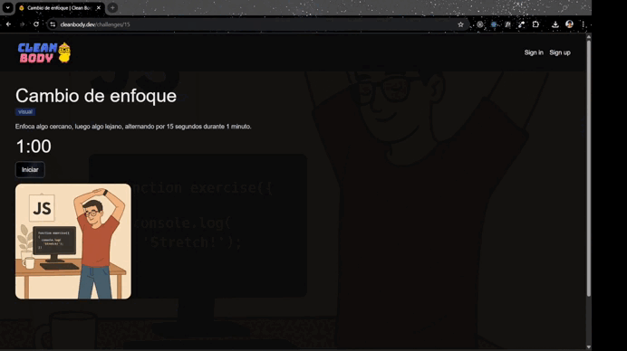

# 💪 Descripción

[cleanbody.dev](https://www.cleanbody.dev/) es una web diseñada para mejorar la salud de programadores o profesionales tech que pasan muchas horas frente a la computadora.

## 🛠 Tecnologías utilizadas

- **Clerk**
- **Supabase**
- **Next.js**
- **TailwindCSS**
- **Chart.js**

## 🧩 Características principales

- Home con resumen del proyecto
- Inicio de sesión con Clerk
- Retos diarios
- Marcar retos como completados
- Ver progreso semanal
- [Perfil compartible con tus estadísticas](https://www.cleanbody.dev/devs/user_2xExpxDb2iynLTUqbkPw1zZjLpu)

## Me gustaría agregar

- Insignias por retos cumplidos y logros especiales
- Sistema de notificaciones push para los retos diarios
- Personalización de retos según preferencias del usuario
- Desafíos grupales
- Seguimiento de desafío
- Agregar alertas por inactividad
- Gráficos de avance por tipos de retos
- URL amigable para perfil compartible

## 🧪 Cómo se usó Clerk

- Registro e inicio de sesión
- Mostrar y editar el perfil del usuario
- Proteger la ruta para dashboard del usuario
- Gestionar la sesión y obtener el userId para relacionar los retos con cada usuario en Supabase
- Guardar el avance de los retos completados del usuario

## Nota final

Gracias al gran [Midudev](https://github.com/midudev) por todo el aporte a la comunidad y hacer posible esta [Hackatón](https://github.com/midudev/hackaton-clerk-2025).

Por fin pude participar en mi primera Hackatón y con un proyecto que quería iniciar hace mucho 🚀

